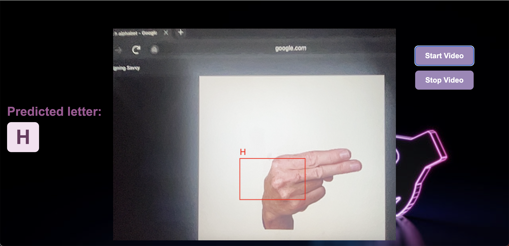
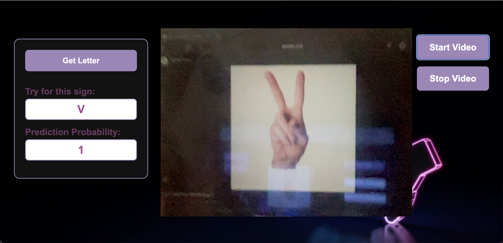

# ASL Translator 🤟

Welcome to the ASL Translator! This web application enables two-way communication between American Sign Language (ASL) and English using real-time video input and deep learning models.

## 🌐 Features

- 🔤 Translate ASL hand signs to English letters using webcam input.
- 📝 Generate random letters for users to mimic using ASL.
- 🔁 Two modes: 
  - ASL to English (via webcam)
  - English to ASL (display animated signs)

## 🛠️ Tech Stack

- **Frontend**: HTML, CSS, JavaScript
- **Backend**: Flask (Python)
- **Model**: CNN-based image classification for ASL letters
- **Libraries**: OpenCV, NumPy, Flask, TensorFlow/Keras

## 📊 Dataset & Model Preparation

To train a robust ASL recognition model, this project follows a custom data pipeline built with OpenCV and MediaPipe:

### 1. data_collection.py – 📸 Collect Sign Images
- Captures images from webcam for 24 different ASL hand signs (A-Y excluding J and Z).
- Stores 100 images per class under ./data/ directory.
- Press Q to start collecting data for each class.

### 2. dataset_creation.py – ✨ Extract Landmarks
- Uses MediaPipe to extract 21 hand landmarks (x, y) from collected images.
- Stores extracted landmark vectors and their class labels in data.pickle.

### 3. dataset_training.ipynb – 🧠 Train the Model
- Loads landmark data from data.pickle.
- Trains a CNN to classify 24 hand gestures using TensorFlow/Keras.
- Saves trained model and label mappings in cnn_model.p.
- Also allows real-time gesture testing with probability feedback.

**📁 All training-related files and outputs are self-contained and customizable.**

## 🚀 Getting Started

### Prerequisites

- Python 3.8+
- pip

### Installation

```bash
git clone https://github.com/ManasiJadhav3012/Signify.git
cd asl-translator
pip install -r requirements.txt
```

### Run the app

```bash
python app.py
```

### Open your browser and go to:

```bash
http://127.0.0.1:5000
```

## 🙌 Credits

This project uses MediaPipe for real-time hand tracking and OpenCV for frame capture and preprocessing.


Once the application is up and running you will be able to see following pages as you navigate through the application.

#### 1. Home Page


#### 2. ASL to English Page


#### 3. English to ASL Page
